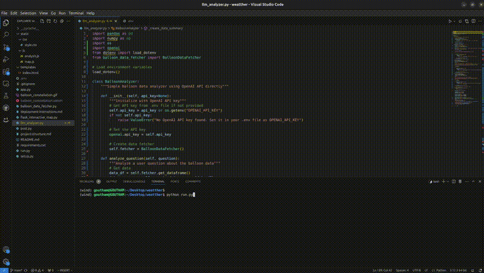

# Balloon Constellation Mission Planner

## Overview

The Balloon Constellation Mission Planner is an interactive web application that provides visualization and LLM-powered analysis of WindBorne Systems' global sounding balloon constellation. This tool helps with real-time monitoring, anomaly detection, and launch planning to optimize the constellation's coverage and effectiveness.

## Video Demo



## Features

- **Real-time Visualization**: Interactive map showing balloon positions and trajectories
- **Historical Data**: View data from up to 24 hours in the past
- **LLM-Powered Analysis**: Get insights, detect anomalies, and receive launch recommendations
- **Robust Design**: Handles potentially corrupted data with grace

## Project Structure

```
balloon-mission-planner/
├── app.py                 # Main Flask application
├── balloon_data_fetcher.py # Data fetching module
├── llm_analyzer.py        # LLM analysis module
├── run.py                 # Application runner script
├── setup.py               # Directory structure setup script
├── static/                # Static files
│   ├── css/
│   │   └── style.css      # CSS styles
│   └── js/
│       ├── map.js         # Map visualization logic
│       └── analysis.js    # LLM analysis logic 
├── templates/             # Jinja2 templates
│   └── index.html         # Main template
└── requirements.txt       # Dependencies
```

## Setup and Installation

### Prerequisites

- Python 3.8 or higher
- pip (Python package manager)
- OpenAI API key (for LLM analysis features)

### Installation

1. Clone this repository:
   ```
   gh repo clone GouthamChandrappa/balloon_constellation
   cd balloon_constellation
   ```

2. Install the required dependencies:
   ```
   pip install -r requirements.txt
   ```

3. Set up the project structure (if needed):
   ```
   python setup.py
   ```

## Running the Application

Run the application using the runner script:

```
python run.py
```

This will:
1. Check for required dependencies
2. Verify the project structure
3. Start the Flask application on http://localhost:5000

## Using the Application

1. **Map Visualization**:
   - View the current balloon positions on the map
   - Use the time selector to view historical data
   - Click "Show Trajectories" to see the path of each balloon over time

2. **LLM Analysis**:
   - Enter your OpenAI API key in the designated field
   - Choose from the available analysis types:
     - General Insights: Overall patterns and observations
     - Anomaly Detection: Identify unusual balloon behavior
     - Launch Recommendations: Suggestions for optimal new balloon deployments
     - Custom Question: Ask specific questions about the constellation

3. **Constellation Stats**:
   - View key statistics about the current balloon constellation
   - See distribution by hemisphere and altitude

## Deployment

### Option 1: Heroku

1. Create a `Procfile`:
   ```
   web: gunicorn app:app
   ```

2. Deploy to Heroku:
   ```
   heroku create balloon-mission-planner
   git push heroku main
   ```

### Option 2: Docker

1. Create a `Dockerfile`:
   ```
   FROM python:3.9-slim
   WORKDIR /app
   COPY . .
   RUN pip install -r requirements.txt
   EXPOSE 5000
   CMD ["gunicorn", "--bind", "0.0.0.0:5000", "app:app"]
   ```

2. Build and run the Docker container:
   ```
   docker build -t balloon-mission-planner .
   docker run -p 5000:5000 balloon-mission-planner
   ```

## Technical Details

### Data Fetching

The application fetches data from WindBorne's API endpoints:
- Current data: https://a.windbornesystems.com/treasure/00.json
- Historical data: https://a.windbornesystems.com/treasure/01.json through 23.json

The data is processed and structured for visualization and analysis.

### LLM Analysis

The application uses the OpenAI API through LangChain to provide intelligent analysis of the balloon data. This includes:
- Pattern recognition in balloon distributions
- Anomaly detection to identify unusual behavior
- Strategic recommendations for new balloon deployments

## Contributing

Contributions are welcome! Please feel free to submit a Pull Request.

## License

This project is licensed under the MIT License - see the LICENSE file for details.

## About WindBorne Systems

WindBorne Systems designs, builds, and launches a new kind of smart weather balloon, then plugs this unique data into AI-based weather models. Their mission is to build a planetary nervous system to help humanity adapt to extreme weather and reduce carbon emissions.

For more information, visit [WindBorne Systems](https://windbornesystems.com).
